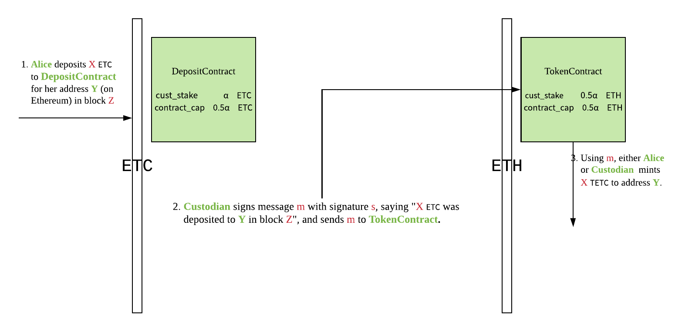
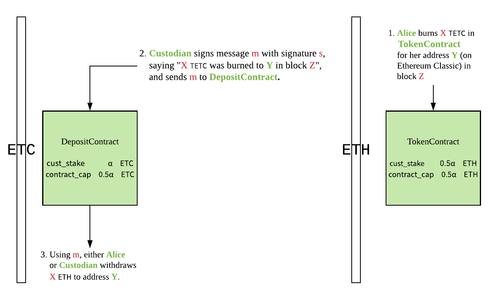
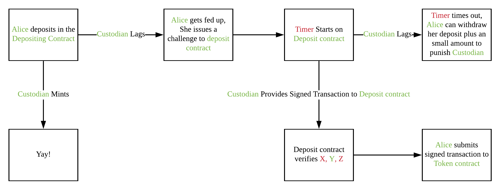
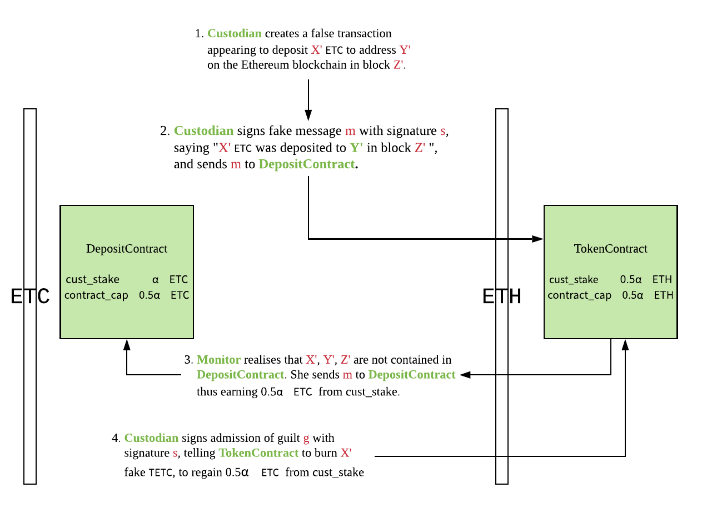

# peaceNotRelay

This is a bridge establishing interoperability between Ethereum and Ethereum Classic in a trustless, low-cost way. Instead of relaying block headers from one chain to the other, it uses a trustless Custodian who verifies transactions across the two chains.  The bridge architecture consists of five main components, which are simply symmetrically replicated to get a two-way bridge.

1. `DepositContract`. This is a smart contract deployed on the home chain by the `Custodian`. This contract serves the following purposes:
    - locking in deposits in home currency from users who wish to get equivalent tokens on the foreign chain;
    - locking in the `Custodian`'s stake in home currency, and slashing it when the `Custodian` is proven to have misbehaved; and
    - allowing withdraws of home currency to anyone who burned equivalent tokens on the foreign chain.
2. `TokenContract`. This is a smart contract deployed on the foreign chain by the `Custodian`. This contract serves the following purposes:
    - minting equivalent tokens on the foreign chain to match deposits on the home chain; and
    - burning equivalent tokens on the foreign chain to allow for withdraws on the home chain.
3. `Custodian`. This is a trustless signatory of transactions who communicates messages between the two chains. Only messages signed by the `Custodian` can call the `withdraw` function in `DepositContract` and the `mint` function in `TokenContract`. The Custodian must stake deposits on both chains, which will be slashed upon discovery of wrongdoing. The respective Contracts will be capped in proportion to the `Custodian`'s stake (see below).
4. `Monitors`. `Monitors` watch transactions on both chains and report wrongdoing in return for a part of the `Custodian`'s deposit. They can either: 
    - report over-staking or under-staking by the `Custodian` to the Contract on the appropriate chain; or 
    - report false `mint` requests submitted to `TokenContract` (on the foreign chain) to `DepositContract`, which can itself verify the report against local transactions on the home chain.
5. `User`. The `User` deposits currency on the home chain in exchange for equivalent tokens on the foreign chain. They can trade or transfer the tokens just like any other token on the foreign chain. Anyone who owns these tokens can burn them on the `TokenContract` to withdraw the original deposit on the home chain.

## Description
### Minting and burning

1. `Alice` deposits `X` ETC to `DepositContract` on Ethereum Classic, meant for her address `Y` on Ethereum. This transaction is processed in block `Z`.
2. `Custodian` acknowledges `Alice`'s deposit by signing a message `m` with their signature `s`. `m` should contain information about `X`, `Y`, and `Z`.
3. By submitting `m` to `TokenContract` on Ethereum, either `Alice` or the `Custodian` can mint `X` ETC-equivalent tokens to address `Y`.

A symmetric process applies for burning newly minted tokens to retrieve the original deposit:

This bridge typically has low gas costs per exchange, only requiring Alice to do a `deposit()` on one chain and the `Custodian` to submit a transaction running the `mint()` function on `TokenContract` (or, in the symmetric case, a `burn()` on one chain and `withdraw()` on the `DepositContract`).

### Custodians and monitors
A Custodian is rewarded for carrying out their duty in the form of transaction fees for every deposit. Custodians are incentivised to be honest using a system of monitors and staking. 

The Custodian is required to commit stakes of:
- α on the home chain, and
- 0.5α on the foreign chain.

These stakes are used to generate appropriate caps for `DepositContract` and `TokenContract`. This ensures that the Custodian's home stake (α) is always greater than the amount they can mint on the foreign chain (0.5α).

Monitors stand to gain at least 0.5α of the custodian's stake if they detect any wrongdoing. Anyone can be a monitor; in practice, a monitor can simply be an open-source script which reads transactions on both `DepositContract` and `TokenContract`. Monitors should report:
- instances of under-staking on the home chain or over-staking on the foreign chain; and
- instances where the Custodian submits a signed message to `TokenContract` containing a transaction not made in `DepositContract`.

### Challenge mechanisms
In the case where the Custodian fails to mint her promised tokens, Alice can issue a challenge by requesting that the Custodian send the signed message to her:

1. Alice deposits in the `DepositContract`
2. Custodian lags in transmitting the `Mint transaction`. As such Alice gets fed up and issues a challenge to the `DepositContract`
3. Timer starts on the `DepositContract`
4. If custodian provides the required signed message to the deposit contract, Alice can `mint()` with that message. Else, the timer times out and Alice can withdraw her deposit with a small bounty from the custodian's stake.

In the symmetric case where Alice burns her foreign tokens, but the Custodian refuses to sign the burn message, Alice can issue a challenge to `TokenContract` requesting that the Custodian send the signed message to her. If the Custodian fails to send the message, Alice simply withdraws an equivalent amount of from the Custodian's stake in `TokenContract`. Recall that since the `TokenContract` has a cap equivalent to the Custodian's foreign stake, Alice will always be able to recover an amount equivalent to her burnt tokens from the Custodian's stake.

### Custodian incentive structures
Below we describe two main vectors of attack as well as how the Custodian's incentive structure handles these vectors:

1. *Minting out of thin air*

After they're caught in the act, custodians can either:

- Send an admission of wrongdoing to `TokenContract`, thus destroying their fraudulent tokens (which are worth ≤0.5α) and regaining 0.5α of their stake from `DepositContract`; or,
- Choose to forfeit their remaining 0.5α stake in `DepositContract`, and retain their fraudulent tokens (which are worth ≤0.5α).

2. *Under-staking on the home chain and/or over-staking on the foreign chain*

The custodian should never be able to under-stake on the home chain or over-stake on the foreign chain. Consider the attack where the custodian stakes <α on the home chain in `DepositContract`, and/or >0.5α on the foreign chain in `TokenContract`. Since the `MintingContract` cap is generated based on the foreign stake, the custodian could mint more tokens than can be slashed in their home stake. This means that, in the event of exposed wrongdoing, the custodian is incentivised to give up their home stake in favour of a larger reward of fake tokens on the foreign chain. 

To prevent this, the monitors should:
- report home stakes that are too low to `TokenContract` (on the foreign chain), or
- report foreign stakes that are too high to `DepositContract` (on the home chain).

These stakes would have been signed by the custodian, so would not be possible for the monitor to fake. Once under-staking or over-staking is detected, the custodian loses the stake in the contract on which the report is made.

### Ending Considerations
- Since the stakes are in ETC and ETH, their ratio would be dependent on the exchange rate. Hence, price volatility of this exchange rate would have to be taken into account when determining if home chain is under-staked / foreign chain is over-staked.
- Requires a Custodian to have a sum of capital 3 times larger than the max deposit threshold of the bridge. The ratio of capital required can be dependent on how trust-less the custodian is required to be. The reasoning for the current ratio is:
  - to allow for enough funds for refund of "stranded" participants on the foreign chain; and
  - to ensure that the Custodian can never mint more fake tokens on the foreign chain than he stands to lose on the home chain ⇒ when caught in a fraudulent transaction, he is always incentivised to give up his foreign tokens and recover his larger home stake.
- Assumes a financially rational custodian that has no external incentives to grief other stakeholders by crashing the system. Whilst the incentive structures are there such that the participants would face no (or perhaps little) financial loss - this would cause a great time-inconvenience to all stakeholders involved.

## Setup

## Collaborators
- Akomba Labs (https://akombalabs.com)
- Kyber Network (https://kyber.network/)
- Ethereum Foundation (https://ethereum.org/)
